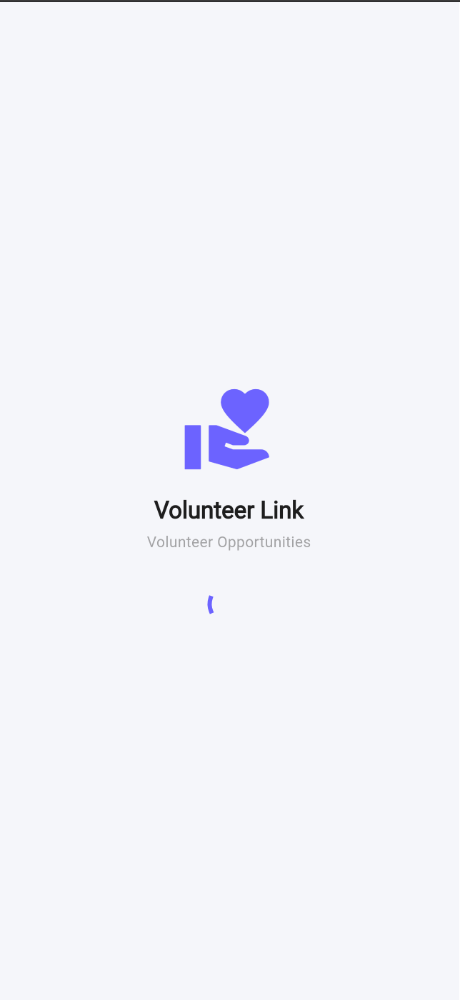
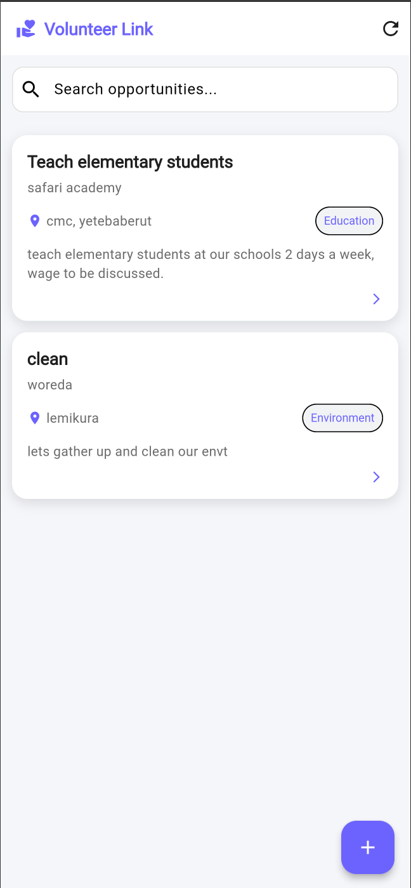
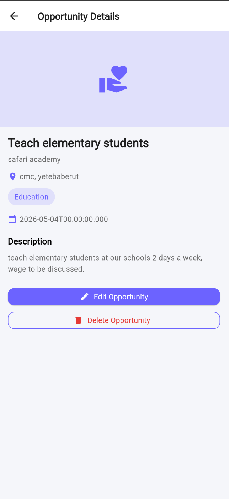
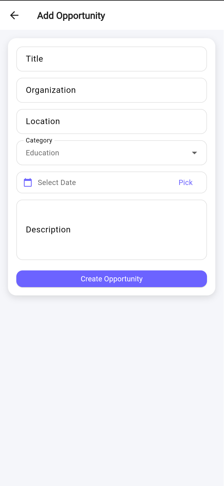
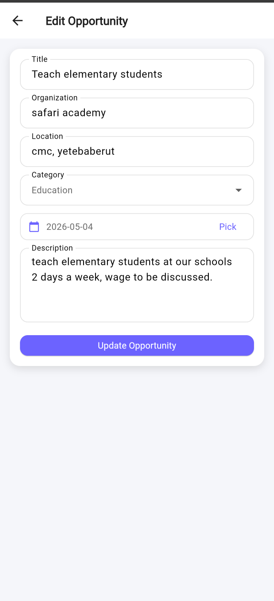

# VolunteerLink App 📱

A Flutter application that performs full **CRUD (Create, Read, Update, Delete)** operations using a public API, built with **Clean Architecture**, **BLoC state management**, and **Dio for networking**.

---

## Features

- Create volunteering opportunities
- View list of opportunities
- View detailed opportunity page
- Update existing opportunities
- Delete opportunities
- Clean UI with reusable components
- Loading, success, and error states
- Navigation handled using **GoRouter**
- Fully structured using Clean Architecture principles

---

## State Management

This project uses:
- **flutter_bloc (BLoC pattern)**  
for managing all app states (loading, success, error, data updates)

---

## Networking

API calls are handled using:
- **Dio package**
- Centralized `DioClient`
- API endpoints defined in a single file (`api_endpoints.dart`)

Base URL: https://6a098c57e7e3f433d4832f9a.mockapi.io
---

## API Used

This project uses a MockAPI service similar to JSONPlaceholder:

- GET `/opportunities`
- GET `/opportunities/:id`
- POST `/opportunities`
- PUT `/opportunities/:id`
- DELETE `/opportunities/:id`
---

## Tech Stack

- Flutter
- Dart
- BLoC (flutter_bloc)
- Dio
- GoRouter
- Clean Architecture

---

## Notes

- All CRUD operations are fully functional
- Proper error handling and loading states implemented
- UI is fully responsive and reusable

---

## Screenshots

Below are screenshots of the running application:

### Splash Screen

### Home Page

### Opportunity Details

### Add Opportunity

### Edit Opportunity

---

## Author

Hemen Solomon